# sushi-order-system-terraform
寿司オーダーシステムのTerraform(AWS)

## インフラ構成図



## terraform module 設計

再利用可能にするため基本的に基本的にリソースはmoduleとして切り出します。

モジュールの分割は主に以下を意識しています

- 依存方向を一方向に
- 集約関係にあるものは一つのモジュールに

参考
[terraform best practices](https://www.terraform-best-practices.com/)
[Google Cloud - Terraform を使用するためのベスト プラクティス](https://cloud.google.com/docs/terraform/best-practices-for-terraform?hl=ja#outputs)

## terraform 管理外のリソース

### tfstate 用バケット

tfstate 管理用の backend S3 バケットは terraform 管理化には置きません。`./helpers/create-tfstate-bucket.sh`のスクリプトでバケットは作成します。

## 規則

* 命名規則
  * タグ名やリソース名はkebub-case

## 踏台サーバーへの SSH 方法

- bastion instance では SG の ingress を許可しない設計にしてます
- egress は許可しており、IGW のあるサブネットに置いているので `yum install` とかはできます
- SSM session 経由で SSH を行います
    - [Session Manager を通して SSH 接続のアクセス許可を有効にして制御する](https://docs.aws.amazon.com/ja_jp/systems-manager/latest/userguide/session-manager-getting-started-enable-ssh-connections.html)
    - SG のために terraform に自宅の IP アドレスを直書きする必要がないです

### 前提

- [AWS CLI 用の Session Manager プラグインをインストールする](https://docs.aws.amazon.com/ja_jp/systems-manager/latest/userguide/session-manager-working-with-install-plugin.html)


### dev 環境
#### 1. `~/.ssh/config` への追記

```
Host sushi-bastion
    User ec2-user
    ProxyCommand sh -c "aws ssm start-session --target $(aws ec2 describe-instances --filters 'Name=tag:Name,Values=%h' Name=instance-state-name,Values=running --query "Reservations[0].Instances[0].InstanceId" --output=text) --document-name AWS-StartSSHSession --parameters 'portNumber=%p'"
```

bastion server のインスタンス ID が確定したら `$(aws ec2 describe-instances ...)` はインスタンス ID に置き換えても問題ありません。


#### 2. 公開鍵の登録

`PUBKEY_PATH` は登録する公開鍵へのパスを設定してください。

```
PUBKEY_PATH=~/.ssh/id_rsa.pub && \
BASTION=sushi-order-system-bastion && \
INSTANCE_ID=$(aws ec2 describe-instances --filters Name=tag:Name,Values=$BASTION Name=instance-state-name,Values=running --query "Reservations[0].Instances[0].InstanceId" --output=text) && \
aws ec2-instance-connect send-ssh-public-key \
--availability-zone ap-northeast-1a \
--instance-id $INSTANCE_ID \
--instance-os-user ec2-user \
--ssh-public-key file://$PUBKEY_PATH && \
ssh-copy-id -f -i $PUBKEY_PATH ec2-user@$BASTION && \
unset PUBKEY_PATH BASTION INSTANCE_ID
```

[必要な IAM ポリシー](https://docs.aws.amazon.com/ja_jp/AWSEC2/latest/UserGuide/ec2-instance-connect-set-up.html#ec2-instance-connect-configure-IAM-role)


#### 3. SSH 実行

初回以外はこれだけで十分です。
```
ssh sushi-order-system-bastion
```

## 運用

### DB migrate

踏み台 EC2 サーバー上では以下を行います

* gitの環境構築
* deployments keyを利用して`sushi-order-system`を`git clone`
* goの環境構築
* `bash_profile`で`DB_HOST`, `DB_PORT`, `DB_USER`, `DB_DATABASE`, `DB_PASSWORD`などのDBの環境変数を`export`するように設定

`sushi-order-system`では[`sql-migrate`](https://github.com/rubenv/sql-migrate)を利用してデータベースのmigrateを行います。
また、`sushi-order-system`のリポジトリで用意されている`Makefile`を利用します。

`ssh sushi-order-system-bastion`で SSH 接続を行い、`cd sushi-order-system`でカレントディレクトリを移動したら、以下のコマンドによりマイグレーションの実行を行います。

```
make migrate-up
```

なお、データベースの環境変数は、`export`コマンドによりターミナル上で設定してください。

`make seed`でテストデータを入れることが可能です。
